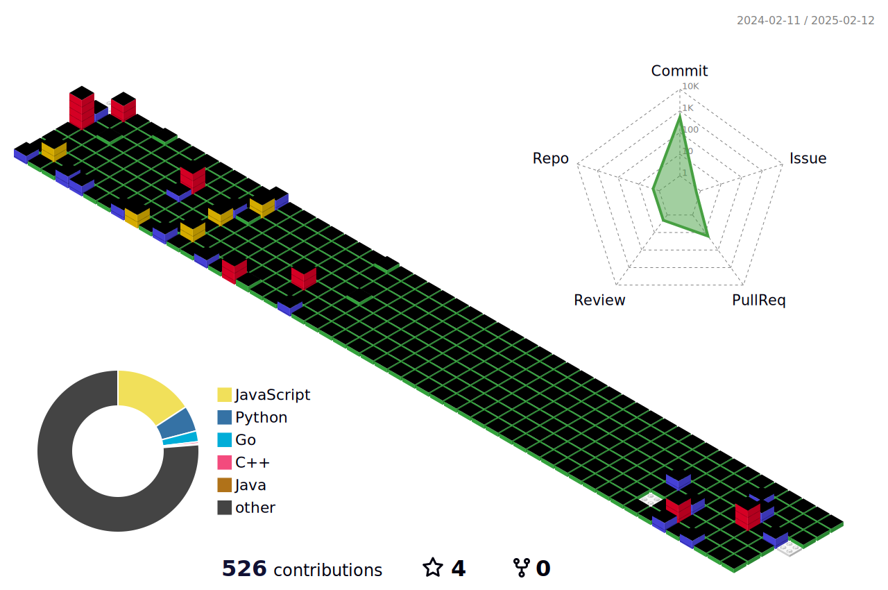

# 🧑🏻‍💻 JOOYUL YOON : Full-stack 🧑🏻‍💻
### [Portfolio](https://scented-lyre-1a5.notion.site/Jooyul-s-Resume-8a156dff49ba4aedbbaa3d6fd18ad777?pvs=4)

### 💪 Platforms & Languages 💪
#### 
Frontend

#### BackEnd

#### DB 

#### Deploy

#### Tools

#### Version Control

## 🌟 Projects 🌟
|Project name|Stacks|Role|Last update|
|:----:|:----:|:----:|:----:|
|[Conti:ed - Playlist Sharing Platform](https://github.com/Conti-ed)|React.js, Django, Sqlite|backend|2024-11-15|
|[Techit Together - Online lecture Dashboard](https://github.com/LIKELION-Techit-Backend/techit)|React.js, Django, MySQL, RDS|backend|2023-05-20|
|[InnSight: Accomodation Website](https://github.com/trishnguyen2001/cmpe165-likehome)|React.js, flask, firebase|full-stack|2023-11-27|
|[Lionstagram - like instagram for Likelion members](https://github.com/jooyul-yoon/SJSULikeLionJava)|Springboot, MySQL, RDS, Docker|full-stack|2023-10-23|
|[Card.io - Workspace Platform](https://github.com/cardotio)|React.js, typescript, Springboot, MySQL|full-stack|2022-12-09|

## 🔥 Hackathon 🔥
|Host|Project Name|Stacks|Role|Last update|
|:----:|:----:|:----:|:----:|:----:|
|LikeLion US|[Decide: AI Recommendation app - !!!Winner!!!](https://github.com/likelion-sjsu/hackathon)|React.js, Django, Sqlite|full-stack|2024-01-28|
|Silicon Valley Korea|[SVK Booking App](https://github.com/chaejunlee/svk)|Next.js, Prisma|full-stack|2023-11-18|

# :mailbox_with_mail: Contacts
<!--  -->

